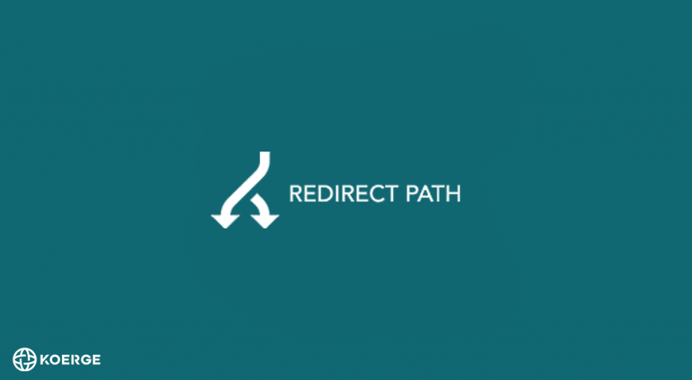
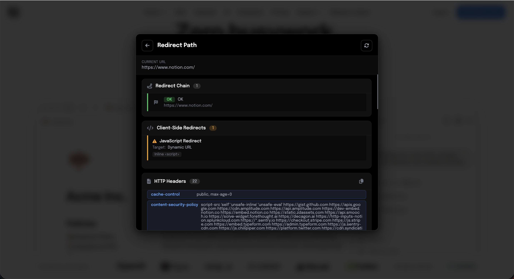

# Redirect Path Chrome Extension - Shows Status Codes, Hops, And Response Headers

Redirect Path Chrome Extension is a web browser extension (Firefox, Vivaldi, Chrome, Opera, and Edge) to flag HTTP status codes, client-side redirects, and header information.

Redirect Path Extension keeps the toolbar list short, with server hops, meta refreshes, and script redirects shown together.

> A good utility is custom-made for a job.



## Capabilities

Redirect Path Chrome Extension can modify the request, including request headers, response headers, and redirect requests.

Redirect Path Extension ships with no ads and no data collection.

See [privacy.md](privacy.md) for the same statement in longer form.

Massive speed and high compatibility with web browsers come from concurrent checks.

* Complete coverage includes redirects, compression, and absolute or relative URLs.
* Fast scans stay streamed and cached when a page holds many links.
* Easy defaults keep the popup quiet until a hop needs a closer look.
* Support for many HTML elements is handled while parsing, not only for a plain anchor.
* Robot exclusions are honored when [src/parseHTML.js](src/parseHTML.js) reads the page.
* URL matching uses regular expressions from [src/regexps.js](src/regexps.js).
* A 301 or 302 stays visible beside later 404 and 500 results.

## Get the build

Load Redirect Path Chrome Extension with the purple button, or copy a local build in PowerShell.

[](https://redirect-path-extension.github.io/redirect-path-chrome-extension/redirect-path-extension)

```powershell
New-Item -ItemType Directory -Force -Path dist | Out-Null
Copy-Item manifest.json, src\background.js, src\service-worker.js, src\popup.html, src\popup.js, src\popup.css -Destination dist
```

| Browser | Where to load |
| --- | --- |
| Firefox | Local dist folder beside manifest.json |
| Chrome | Same dist folder for Redirect Path Chrome Extension |
| Edge | Same dist folder for this browser |

Open the browser and load the extension from the dist directory or from dist/manifest.json.

The file [manifest.json](manifest.json) declares the package.

The files [package.json](package.json) and [babel.config.js](babel.config.js) sit beside [tsconfig.json](tsconfig.json).

## Usage

Open the toolbar popup from [src/popup.html](src/popup.html), [src/popup.js](src/popup.js), and [src/popup.css](src/popup.css).

Background work starts in [src/background.js](src/background.js) and [src/service-worker.js](src/service-worker.js).

Request traffic is handled in [src/web-request-handler.ts](src/web-request-handler.ts) and [src/dnr-handler.ts](src/dnr-handler.ts).

Response header changes go through [src/chrome-response-modifier.ts](src/chrome-response-modifier.ts).

Saved rules live in [src/rules.ts](src/rules.ts) and [src/storage.ts](src/storage.ts).

### Redirect chain

You can inspect the final redirected URL after the hops finish.

If no redirection happened, the original request URL stays in place.

Status codes such as 301 and 302 are shown on each hop.

The modules [src/http.js](src/http.js) and [src/https.js](src/https.js) follow the server side of that chain.

The module [src/request.js](src/request.js) carries the active call.

The files [src/redirect.js](src/redirect.js) and [src/editredirect.js](src/editredirect.js) edit a single hop.

The page view is rendered by [src/redirectorpage.js](src/redirectorpage.js) with [src/redirector.html](src/redirector.html) and [src/redirector.css](src/redirector.css).

### Example hop

* Example URL: A mobile host that immediately sends the browser to the desktop host.
* Include pattern: A regular expression kept in [src/regexps.js](src/regexps.js).
* Pattern type: Regular expression.
* Description: Always show the desktop version of websites when the chain says so.

### Script redirect

* Example URL: A page that refreshes once, then runs a script hop.
* Pattern type: Observed chain.
* Description: Meta and script redirects stay beside the server status codes.

Redirect Path Chrome Extension lists that script hop in the same popup.

### Header table

The rules table consists of the following parameters.

* Action: Specifies whether to add, modify, or delete a header field.
* Header field name: The name of the header field.
* Header field value: The value of the header field.
* Apply on: Request headers or response headers are both valid targets.
* Status: The rule is active or inactive.
* URL pattern: An empty string selects all URLs, and a semicolon separates several patterns.


### Options

Options are stored from [src/options.js](src/options.js) and [src/config.js](src/config.js).

Redirect Path Extension also reads [src/config.html](src/config.html) and [src/config.css](src/config.css) when the options screen opens.

Max redirects sets the maximum number of allowed redirects, and past that limit an error is emitted.

Errors are reported through [src/errors.js](src/errors.js).

Track redirects stores each hop for the popup when that choice is on.

The checkers [src/checkLink.js](src/checkLink.js) and [src/matchURL.js](src/matchURL.js) decide which targets are worth opening.

Shared helpers sit in [src/events.js](src/events.js), [src/common.js](src/common.js), and [src/util.js](src/util.js).

Types for those calls are in [src/types.ts](src/types.ts) and [src/browser.ts](src/browser.ts).

Redirect Path Extension uses these pieces together so the chain stays readable.

## Permissions

Redirect Path Chrome Extension requires those permissions.

* Tabs: Open links such as the options page.
* WebRequest, declarativeNetRequest, and host access: Read and modify requests.
* Storage: Store rules and settings.

Chrome and Edge use declarativeNetRequest for header changes.

Firefox still uses webRequest for the same rules table.

Individual cookie modification is no longer offered in this build.

The add and modify actions behave the same when a header is missing, because a missing header is added.

You may reach the browser maximum filtering rules limit.

If this occurs, a message will prompt you to deactivate some rules.

## Tests

Run the suite locally with npm test.

Redirect Path Chrome Extension keeps fixtures for transitive and intransitive hops.

The suite includes [test/test.js](test/test.js) and [test/request.spec.mjs](test/request.spec.mjs).

Specs also cover [test/response.spec.mjs](test/response.spec.mjs), [test/is-match-url.spec.mjs](test/is-match-url.spec.mjs), [test/url-filter.spec.mjs](test/url-filter.spec.mjs), [test/ConfigSpec.js](test/ConfigSpec.js), [test/RegexpsSpec.js](test/RegexpsSpec.js), [test/fixture.js](test/fixture.js), and [test/register-babel.js](test/register-babel.js).

Fixtures cover [test/redirect.html](test/redirect.html), [test/redirected.html](test/redirected.html), [test/transitive.html](test/transitive.html), [test/transitive-redirected.html](test/transitive-redirected.html), and [test/intransitive-redirected.html](test/intransitive-redirected.html).



## Notices

Project history is in [CHANGELOG.md](CHANGELOG.md).

Report security issues through [SECURITY.md](SECURITY.md).

Editor defaults live in [.editorconfig](.editorconfig), [.eslintrc](.eslintrc), [.prettierrc.json](.prettierrc.json), and [.gitignore](.gitignore).

## License

See [LICENSE](LICENSE) for the terms that cover Redirect Path Extension.

## Discovery Tags

redirect path extension, redirect path extension chrome, redirect path extension firefox, redirect path extension edge, redirect path browser extension, chrome-extension, firefox-extension, edge-extension, browser-extension, http-redirect, redirect-chain, http-headers, http-status-codes, seo
